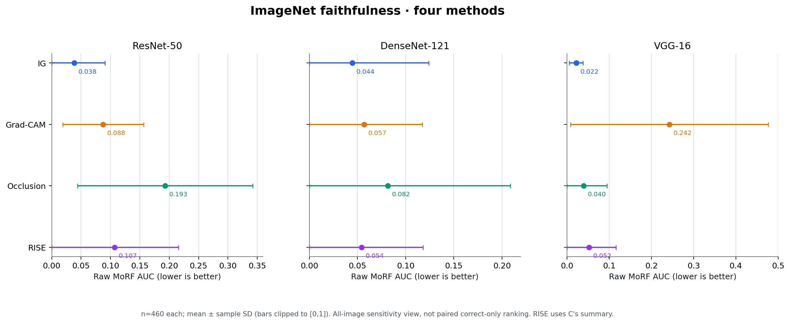
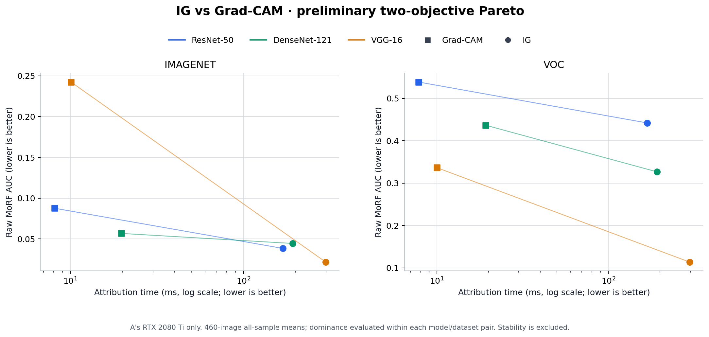

# 成员 D：中期四方法忠实性与 A 组初步 Pareto

日期：2026-10-09。以下是中期汇报材料，不是 36 单元最终统计结论。

## 图 1：四方法 ImageNet 忠实性

三模型 × 四方法均为正式 `eval` 的 460 张全样本 `faithfulness_morf_auc_raw` 均值，
误差线为样本标准差；AUC 越低越好。这里的**全样本**结果仅作为中期描述性/敏感性
对比，不替代预测正确组的主分析。

| 模型 | IG | Grad-CAM | Occlusion | RISE |
|---|---:|---:|---:|---:|
| ResNet50 | 0.038372 | 0.087643 | 0.193132 | 0.107078 |
| DenseNet121 | 0.044469 | 0.056758 | 0.081563 | 0.054237 |
| VGG16 | 0.021651 | 0.242406 | 0.039684 | 0.052469 |

可直接用于汇报的一句话：**在 ImageNet 全样本 raw MoRF AUC 的中期描述图中，IG
在三个模型上均为最低；由于跨组预测上下文未严格配对且 RISE 当前只收到已提交摘要，
这不是四方法最终排名。**

数据来源和验收边界：

- IG/Grad-CAM：`analysis/a_ig_gradcam_summary.csv`，A 的 12 个 460 张基础评估
  单元；详细契约、配置哈希与运行环境见 `docs/A_IG_GRADCAM_RESULTS.md`。
- Occlusion：D 已验收的 `results/analysis/occlusion_eval_acceptance/units.csv`
  中三个 ImageNet 的正式汇总；交接包/逐图/哈希校验见
  `docs/D_OCCLUSION_EVAL_ACCEPTANCE.md`。结果目录由 Git 忽略。
- RISE：C 在 `feat/rise-formal-eval` 的提交 `09e850e` 中记录的
  `docs/RISE_FORMAL_RESULTS.md` 三个 ImageNet 单元；本地冻结摘录为
  `analysis/midterm_rise_imagenet.json`，含各配置哈希和 460 张汇总。
  C 的原始逐图包当前尚未在 D 工作区接收或独立重算，因此不能称为 D 已验收原始 RISE 数据。

A 的 ImageNet ResNet50 预测命中 409/460，而 B/C 记为 408/460；直接把不同方法的
正确组均值拼成严格配对图会混淆样本/预测差异。待取得 A/C 的逐图指标、预测及来源
绑定后，应先核对共同正确样本，再做正式四方法主分析和统计检验。当前图不比较 GPU
耗时，也不声称 RISE 的稳定性已完成。

## 图 2：A 同机 IG / Grad-CAM 初步 Pareto

只取 A 在**同一 RTX 2080 Ti** 上完成的 IG/Grad-CAM 两种方法，用各单元 460 张
全样本 raw MoRF AUC 和归因时间均值，分别在每一个“模型 × 数据集”配对内判断
两个目标（两者都越低越好）的支配关系。六个配对的两种方法均为非支配点：IG 的 AUC
均更低，Grad-CAM 的计时均更短。图中连线只连接同一模型/数据集的一对方法，不能把
不同模型或 ImageNet/VOC 的点当作统一 Pareto 前沿。

可直接用于汇报的一句话：**A 的同机六组配对均显示 IG 更低的 raw MoRF AUC 与
Grad-CAM 更短的归因时间之间存在双目标取舍，两者在各自成对比较中均非支配；
稳定性尚未纳入，不能称作三维 Pareto 结论。**

两图可用 `python -m analysis.plot_midterm_d` 复现；脚本拒绝缺失、重复、非 460 张、
非有限或无配置哈希的输入。RISE 摘要只用于第一张图，不参与第二张跨 GPU 耗时图。
中期不要求完整 ANOVA；正式统计仍待可配对的逐图数据与其余方法/稳定性输入。
