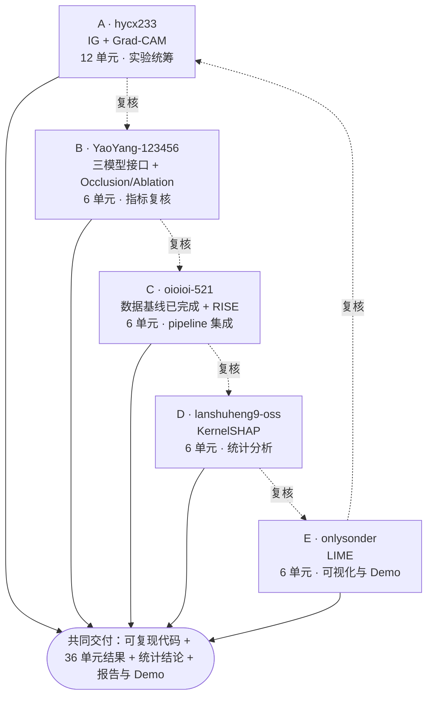

# 当前执行分工与协作图

更新时间：2026 年 9 月 16 日。

本分工直接安排到人，但安排的是当前阶段的“纵向任务包”，不是永久岗位。每个人都需要完成方法代码、对应实验、结果说明和交叉复核；任务包完成后可以根据项目瓶颈重新调整。

## 分工图

“12/6 单元”按“负责方法 × 3 个模型 × 2 个数据集”计算。成员负责把自己的纵向任务从实现一直推进到结果落盘，但任何人都可以支援其他任务包。

## 已安排的任务包

| 成员 | 方法与实验 | 同时承担 | 必须提交 |
| --- | --- | --- | --- |
| A `hycx233` | IG、Grad-CAM，共 12 个主体单元 | 组织实验节奏；维护归因统一接口；协助 D 调试高成本 KernelSHAP | 两种方法实现、12 单元配置/日志/CSV、失败重跑记录 |
| B `YaoYang-123456` | Occlusion/Ablation，共 6 个主体单元 | 封装 VGG-16、ResNet-50、DenseNet-121；核对预测类别、准确率和指标输入 | 三模型统一接口、准确率/预测表、6 单元结果、指标复核记录 |
| C `oioioi-521` | RISE，共 6 个主体单元 | 前期数据收集已完成；冻结数据版本；维护加载器、metadata、`run_unit.py`、配置和结果合并 | 数据交接说明、RISE 实现、6 单元结果、可续跑 pipeline |
| D `lanshuheng9-oss` | KernelSHAP，共 6 个主体单元 | 聚合长表；完成 ANOVA/替代检验、效应量、Pareto、相关性和方法选择指南 | KernelSHAP 实现与结果、统计脚本、图表和 RQ1–RQ3 初步结论 |
| E `onlysonder` | LIME，共 6 个主体单元 | 结果可视化、样例热力图、README、PPT 和固定 Demo；执行一次独立复现 | LIME 实现与结果、统一图表、演示材料、复现记录 |

Saliency 作为低成本可选对照，不单独占主体矩阵；若时间允许，由 A 和 E 共同补充。

## 共同工作要求

以下内容不是某个人的专属职责：

1. 每人都要写代码并实际跑完自己方法对应的实验单元。
2. 每人都要为自己的方法写一段结果解释，并提供至少一张可进入报告/PPT 的图。
3. 每人都要按图中的环形关系复核下一位成员的代码、配置和一份结果样本。
4. 正式跑批时按可用 GPU 动态互借机器；方法负责人负责配置与结果正确性，不要求实验必须在本人电脑上运行。
5. 某任务阻塞超过 1 天时，复核人立即加入排查；超过 2 天时由全组重新拆分，不等待单人解决。
6. 文档由各任务包负责人提供本部分内容，E 只负责统一风格和整合，不代写所有内容。

## 接口顺序

1. C 提供冻结的数据清单、加载入口和 metadata。
2. B 提供统一模型接口与预测结果。
3. A/C 完成统一归因接口和配置驱动实验入口。
4. A–E 分别跑完所分配方法的实验单元，并统一写入结果 schema。
5. D 从全量结果生成统计分析；其余成员复核与本人方法相关的结论。
6. E 汇总图表和 Demo；全组分别提交本人参与部分的报告文字和答辩要点。

更完整的技术方案、实验矩阵、风险和结果 schema 见 [`../XAI01-04_小组工作指导.md`](../XAI01-04_小组工作指导.md)。
