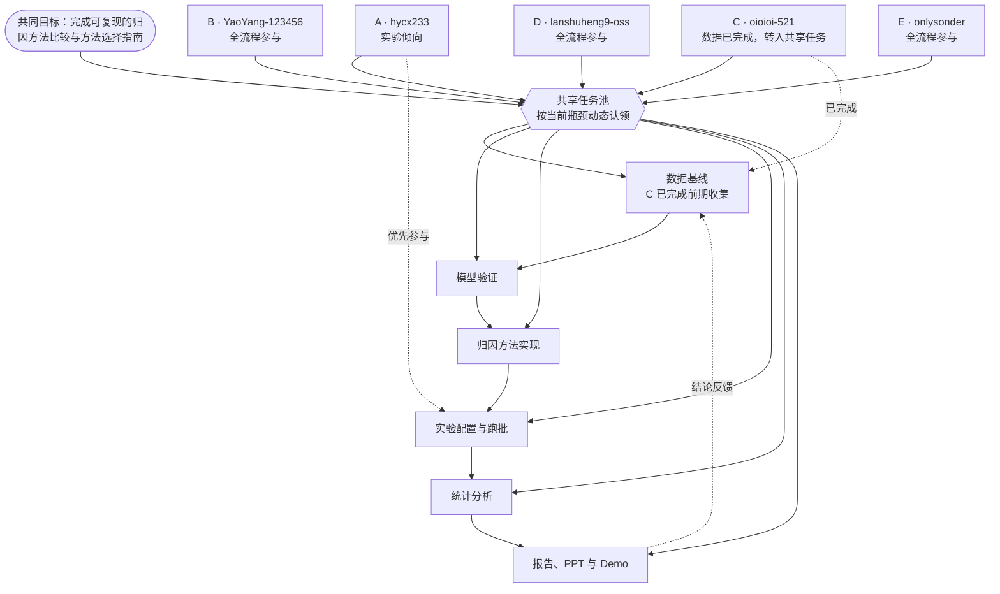

# 团队协作与动态分工

更新时间：2026 年 9 月 16 日。

本项目不再采用“一个人永久对应数据、模型、实验、分析或文档”的固定岗位制。五名成员共同参与完整项目闭环，任务根据当前瓶颈、个人意愿和可用时间动态认领。

目前只保留两项明确事实：

- A `hycx233` 更倾向于实验工作，优先发起和参与归因方法调试、实验配置、GPU 跑批与失败单元排查，但不是唯一跑实验的人。
- C `oioioi-521` 已完成前期数据收集与资源整理；数据基线由全组共享，C 后续可转入模型、实验、分析、文档或集成等任意工作，不被继续固定在“数据岗”。

## 协作图

图中的连线表示“可以参与”，不是职责边界。任何成员都可以跨节点工作；A 的“实验倾向”和 C 的“数据已完成”仅用于安排优先级与记录已有贡献。

## 动态认领规则

1. 每项任务只在当前阶段指定一名主执行人和至少一名协作人，任务结束后关系自动解除，不形成永久岗位。
2. 主执行人负责把该任务推进到可验收状态；协作人必须理解实现并完成一次复核，避免信息只掌握在一人手中。
3. A 在实验任务中拥有优先选择权；正式跑批量大时，其他成员共同分担配置、运行、日志检查和失败重跑。
4. C 已完成的数据收集记入项目贡献；除非出现缺失、版本或质量问题，不再重复安排数据搜集。
5. B、D、E 不预设固定方向，根据当前瓶颈从模型、实验、分析、文档、Demo 和复现任务中认领。
6. 每次例会只确认“当前任务—主执行人—协作人—验收物—截止时间”，不再确认永久角色。

## 当前阶段任务池

| 任务 | 建议参与方式 | 验收物 |
| --- | --- | --- |
| 数据基线冻结 | C 说明已有数据；任一成员复核 | 固定清单、metadata、加载说明 |
| 三模型统一接口 | 2 人结对认领 | 统一推理接口、准确率/预测表、冒烟测试 |
| 归因方法与指标 | A 优先，至少 1 人协作 | 统一归因接口、指标实现、debug 结果 |
| 36 单元实验矩阵 | A 优先组织，全组按设备和时间分担 | 配置快照、运行日志、逐图与聚合 CSV |
| 统计与方法选择 | 任意 2 人结对 | ANOVA/替代检验、效应量、Pareto、相关性、选择指南 |
| 报告与 Demo | 全组共同提供本人参与部分的材料 | README、报告、PPT、固定演示流程 |
| 干净环境复现 | 未主导该功能的成员优先执行 | 从零运行记录、问题清单、修复结果 |

## 阶段推进

- M2：全组打通“数据 → 模型 → 归因 → 指标 → CSV”最小闭环。
- M3：动态分担方法接入和 debug 跑批，形成第一版可比较结果。
- M4：按机器与时间拆分 36 个实验单元，并行完成跑批、复核和统计分析。
- M5：所有成员共同校对本人参与的代码、数据、结论和汇报材料；由未主导对应模块的成员做交叉复现。

更完整的技术方案、实验矩阵、风险和结果 schema 见 [`../XAI01-04_小组工作指导.md`](../XAI01-04_小组工作指导.md)。若其中仍出现旧的固定岗位表述，以本文件的动态协作规则为准。
